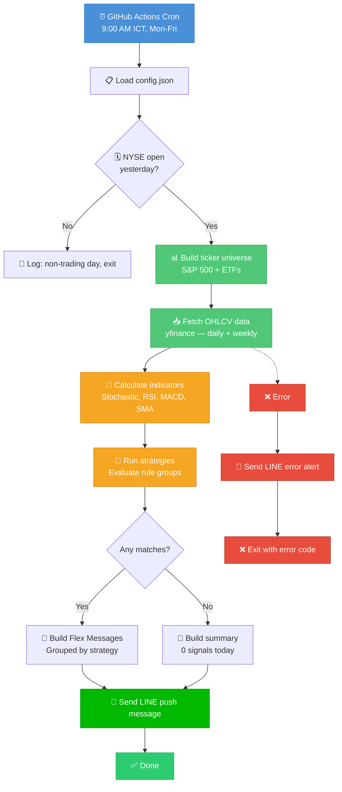

# 📊 Market Screener Bot

A Python bot that screens **S&P 500 stocks + popular ETFs** daily using technical indicators, groups results by configurable strategies, and sends rich **LINE Flex Messages** every weekday morning.

> **Completely free** — Uses yfinance (no API key), LINE Messaging API free tier (200 msgs/month), and GitHub Actions (free for public repos).

---

## ✨ Features

- **Multi-timeframe analysis** — Daily + Weekly confluence screening
- **Configurable strategies** — Define rule groups with AND logic (e.g., Stochastic < 30 AND RSI < 30 AND above 200 SMA)
- **Both buy & sell signals** — Oversold (buy) and overbought (sell) detection
- **Rich LINE notifications** — Beautiful Flex Message cards with ticker, price, and indicator values
- **Auto-scheduled** — Runs every weekday at 9:00 AM ICT via GitHub Actions
- **Market-aware** — Skips weekends and US market holidays automatically
- **Error alerts** — Sends LINE error notification if the screener fails

## 📐 Architecture Flow



## 📁 Project Structure

```
market-screener-bot/
├── src/
│   └── screener/
│       ├── __init__.py           # Package marker
│       ├── main.py               # Entry point — orchestrates the pipeline
│       ├── config.py             # Loads & validates config.json
│       ├── tickers.py            # Fetches S&P 500 list + curated ETFs
│       ├── data_fetcher.py       # Downloads OHLCV data via yfinance
│       ├── indicators.py         # Pure functions: Stochastic, RSI, MACD, SMA
│       ├── strategies.py         # Strategy engine — applies rule groups
│       ├── notifier.py           # LINE Messaging API client
│       └── formatter.py          # Builds LINE Flex Message JSON
├── tests/
│   ├── conftest.py               # Shared fixtures (sample OHLCV data)
│   ├── test_indicators.py        # Test indicator math
│   └── test_strategies.py        # Test strategy matching logic
├── config.json                   # Strategies, thresholds, ticker lists
├── .github/
│   └── workflows/
│       └── screener.yml          # GitHub Actions cron job
├── pyproject.toml                # Project metadata, ruff, mypy config
├── requirements.txt              # Pinned dependencies
└── README.md                     # This file
```

---

## 🚀 Quick Start

### 1. Prerequisites

- Python 3.12+
- A [LINE Developer account](https://developers.line.biz) (free)
- A GitHub account (free)

### 2. LINE Messaging API Setup

1. Go to [LINE Developers Console](https://developers.line.biz/console/)
2. **Create a Provider** (e.g., "My Bots")
3. **Create a Messaging API Channel**
   - Channel type: Messaging API
   - Give it a name (e.g., "Stock Screener")
   - Choose a category and subcategory
4. **Get your Channel Access Token**
   - Go to the **Messaging API** tab
   - Scroll to "Channel access token (long-lived)"
   - Click **Issue** to generate a token
   - Copy and save this token
5. **Get your User ID**
   - Go to the **Basic settings** tab
   - Find "Your user ID" at the bottom
   - Copy and save this ID
6. **Add the bot as a friend**
   - In the **Messaging API** tab, scan the QR code with your LINE app
   - Or search for the bot's LINE ID and add it

### 3. Local Development

```bash
# Clone the repository
git clone https://github.com/YOUR_USERNAME/market-screener-bot.git
cd market-screener-bot

# Create virtual environment
python -m venv venv
venv\Scripts\activate        # Windows
# source venv/bin/activate   # macOS/Linux

# Install dependencies
pip install -r requirements.txt

# Set environment variables
set LINE_CHANNEL_ACCESS_TOKEN=your_channel_access_token_here
set LINE_USER_ID=your_user_id_here

# Run the screener
cd src
python -m screener.main
```

### 4. Deploy to GitHub Actions

1. **Push to GitHub**
   ```bash
   git init
   git add .
   git commit -m "Initial commit: market screener bot"
   git remote add origin https://github.com/YOUR_USERNAME/market-screener-bot.git
   git push -u origin main
   ```

2. **Add GitHub Secrets**
   - Go to your repository → **Settings** → **Secrets and variables** → **Actions**
   - Click **New repository secret** and add:
     - Name: `LINE_CHANNEL_ACCESS_TOKEN` → Value: your token
     - Name: `LINE_USER_ID` → Value: your user ID

3. **Test the workflow**
   - Go to **Actions** tab → **Daily Stock Screener** → **Run workflow**
   - Check the run logs and your LINE app for the message

4. **Done!** The bot will now run automatically every weekday at 9:00 AM ICT.

---

## ⚙️ Configuration

All settings are in [`config.json`](config.json). You can customize strategies, indicators, and ticker lists without touching Python code.

### Strategy Configuration

Each strategy is a group of rules combined with **AND logic**. A ticker must satisfy ALL rules in a strategy to appear in the results.

```json
{
  "strategies": [
    {
      "name": "Oversold Bounce (Daily)",
      "description": "Oversold on daily with uptrend filter",
      "timeframe": "daily",
      "rules": [
        {"indicator": "stochastic_k", "operator": "<", "value": 30},
        {"indicator": "rsi", "operator": "<", "value": 30},
        {"indicator": "price_vs_sma200", "operator": ">", "value": 0}
      ]
    }
  ]
}
```

### Available Indicators

| Indicator | Description | Typical Oversold | Typical Overbought |
|---|---|---|---|
| `stochastic_k` | Stochastic %K oscillator | < 30 | > 70 |
| `stochastic_d` | Stochastic %D (signal line) | < 30 | > 70 |
| `rsi` | Relative Strength Index | < 30 | > 70 |
| `macd_crossover` | MACD crossover signal | `== 1` (bullish) | `== -1` (bearish) |
| `price_vs_sma200` | Price / 200-day SMA ratio | — | — |

### Available Operators

`<`, `<=`, `>`, `>=`, `==`, `!=`

### Default Strategies

The bot ships with 4 pre-configured strategies:

| # | Strategy | Timeframe | Signal | Rules |
|---|---|---|---|---|
| 1 | Oversold Bounce | Daily | 🟢 Buy | Stoch < 30, RSI < 30, Price > 200 SMA |
| 2 | Oversold Confluence | Weekly | 🟢 Buy | Stoch < 30, RSI < 40 |
| 3 | MACD Bullish Crossover | Daily | 🟢 Buy | MACD cross up, Price > 200 SMA |
| 4 | Overbought Alert | Daily | 🔴 Sell | Stoch > 70, RSI > 70 |

### Indicator Parameters

```json
{
  "stochastic_k_period": 14,
  "stochastic_d_period": 3,
  "rsi_period": 14,
  "macd_fast": 12,
  "macd_slow": 26,
  "macd_signal": 9,
  "sma_period": 200,
  "data_period": "1y"
}
```

### ETF List

The bot automatically fetches the S&P 500 ticker list from Wikipedia. ETFs are configured manually in `config.json`:

```json
{
  "etf_list": ["SPY", "QQQ", "IWM", "DIA", "XLF", "XLE", "XLK", "XLV", ...]
}
```

---

## 🧪 Testing

```bash
# Run all tests
pytest tests/ -v

# Run with coverage report
pytest tests/ --cov=screener --cov-report=term-missing

# Run specific test file
pytest tests/test_indicators.py -v
```

---

## 🔧 Troubleshooting

### Common Issues

| Issue | Solution |
|---|---|
| **No LINE message received** | Verify you added the bot as a friend. Check `LINE_USER_ID` is correct. |
| **yfinance download fails** | yfinance depends on Yahoo Finance. Retry or reduce batch size. |
| **"Non-trading day" every day** | Check your timezone settings. The bot uses NYSE calendar. |
| **GitHub Actions not running** | Ensure the workflow file is on the `main` branch. Check Actions tab is enabled. |
| **Too many/few signals** | Adjust thresholds in `config.json` (e.g., change RSI < 30 to RSI < 35). |

### Checking Logs

- **GitHub Actions**: Go to Actions tab → click the run → view step logs
- **Local**: stdout output shows a summary of tickers screened and signals found

---

## 📋 Design Decisions

| Decision | Choice | Rationale |
|---|---|---|
| Data source | yfinance | Free, no API key, supports all US stocks & ETFs |
| Notification | LINE Messaging API | Rich Flex Messages, 200 free msgs/month is plenty |
| Hosting | GitHub Actions | Zero cost, zero infrastructure, simple YAML config |
| Config format | JSON | No extra dependencies, human-readable |
| Indicators | Pure functions | Easily testable, no side effects |
| Strategies | JSON rule groups | Users can add/modify strategies without coding |

---

## 📄 License

MIT License — see [LICENSE](LICENSE) for details.
